<div align="center">

# 🏥 Vitalis DB
### Sistema Integral de Administración de Centros de Salud


[](https://www.oracle.com/)
[](https://www.docker.com/)
[](LICENSE)
[]()

**Universidad Nacional Sede Región Brunca** | **II Ciclo 2025**

[🚀 Inicio Rápido](#-instalación-y-configuración) • [📖 Documentación](#-documentación-adicional) • [👥 Equipo](#-equipo-de-desarrollo) • [📞 Soporte](#-soporte-y-contribuciones)

</div>

---

## 🌟 Acerca del Proyecto

> **Vitalis DB** es una solución empresarial de gestión hospitalaria construida sobre Oracle 19c, diseñada para optimizar la administración de centros de salud mediante automatización inteligente, alta disponibilidad y seguridad robusta.

### 💡 ¿Por qué Vitalis DB?

| Característica | Beneficio |
|----------------|-----------|
| **🔄 Alta Disponibilidad** | Sistema standby con sincronización automática cada 5 minutos |
| **🤖 Automatización Completa** | Jobs programados para mantenimiento, notificaciones y auditoría |
| **🔐 Seguridad Multinivel** | Roles, perfiles, encriptación y auditoría completa |
| **📧 Notificaciones Inteligentes** | Sistema de emails directo desde Oracle con encriptación |
| **📊 Gestión Financiera** | Control completo de planillas, pagos y reportes bancarios |
| **🐳 Containerizado** | Despliegue rápido con Docker Compose |

## 🎯 Objetivos del Proyecto

<table>
<tr>
<td width="33%" align="center">
<h3>🎨 Diseño</h3>
Aplicar modelos relacionales avanzados para sistemas de salud con normalización óptima
</td>
<td width="33%" align="center">
<h3>⚙️ Administración</h3>
Implementar soluciones de alta disponibilidad con Oracle Data Guard y automatización
</td>
<td width="33%" align="center">
<h3>🔒 Seguridad</h3>
Establecer capas de seguridad con roles, encriptación y auditoría completa
</td>
</tr>
</table>

## 🚀 Funcionalidades Principales

<details open>
<summary><h3>👥 Gestión de Personal Médico y Administrativo</h3></summary>

```
✨ Características Destacadas
├── 📝 Auto-registro de personal médico y administrativo
├── ✅ Sistema de aprobación por administradores
├── 🔑 Generación automática de usuarios y credenciales
├── 👤 Gestión completa de perfiles y permisos por rol
├── 💳 Registro de información bancaria para pagos electrónicos
├── 📄 Control de documentación y requisitos por puesto
└── 🔒 Desactivación automática por inactividad (90 días)
```
</details>

<details open>
<summary><h3>🏢 Administración de Centros de Salud</h3></summary>

- 🏥 **Registro y gestión de centros** médicos con jerarquía regional
- ⏰ **Control de puestos** médicos y asignación de turnos
- 💉 **Catálogo de procedimientos** médicos con tarifas
- 📅 **Escalas de atención** base y mensuales automatizadas
- 💰 **Sistema de cobros** y control de pagos por servicios
- 📊 **Reportes operativos** por centro y región
</details>

<details open>
<summary><h3>💰 Sistema de Planillas y Pagos</h3></summary>

| Módulo | Funcionalidad |
|--------|---------------|
| **Tipos de Planilla** | Creación y configuración de planillas personalizadas |
| **Generación Automática** | Procesamiento mensual de planillas por procedimiento |
| **Comprobantes Digitales** | Envío automático de comprobantes por email |
| **Control de Deducciones** | Gestión de movimientos, descuentos y bonificaciones |
| **Reportes Bancarios** | Archivos de depósito masivo para bancos |
| **Auditoría Completa** | Trazabilidad de todos los pagos y modificaciones |
</details>

<details open>
<summary><h3>📊 Control Financiero Centralizado</h3></summary>

- 📈 **Resúmenes mensuales** de ingresos y gastos consolidados
- 🏥 **Reportes por centro** de salud con desglose detallado
- 💵 **Control de transacciones** con auditoría temporal
- 📉 **Análisis de tendencias** y proyecciones financieras
- 🧾 **Integración bancaria** para conciliación automática
</details>

---

## 🔐 Arquitectura de Seguridad Multinivel

```mermaid
graph TB
    A[👤 Usuario] --> B{Autenticación}
    B -->|Válido| C[Roles Oracle]
    B -->|Inválido| Z[❌ Acceso Denegado]
    C --> D[ROL_ADMIN]
    C --> E[ROL_MEDICO]
    C --> F[ROL_ADMINISTRATIVO]
    D --> G[Perfiles de Usuario]
    E --> G
    F --> G
    G --> H[Control por Pantalla]
    H --> I[📊 Acceso a Datos]
    I --> J[Auditoría/Bitácora]
```

<div align="center">



</div>

### 🛡️ Capas de Seguridad Implementadas

| Capa | Componente | Descripción |
|------|-----------|-------------|
| **1️⃣** | **Autenticación Oracle** | Usuarios nativos con contraseñas encriptadas |
| **2️⃣** | **Roles Funcionales** | `ROL_ADMIN`, `ROL_MEDICO`, `ROL_ADMINISTRATIVO` |
| **3️⃣** | **Perfiles de Usuario** | Control granular por funcionalidad y pantalla |
| **4️⃣** | **Procedimientos Seguros** | Asignación automática de permisos al crear usuarios |
| **5️⃣** | **Auditoría Completa** | Bitácora de todas las operaciones críticas |
| **6️⃣** | **Encriptación** | Claves de email y datos sensibles encriptados |

### 📧 Sistema de Notificaciones Seguro

```sql
-- Integración con Brevo API
PKG_BREVO_MAIL
├── Configuración parametrizada (host, puerto, credenciales)
├── Encriptación de claves con DBMS_CRYPTO
├── Envío directo desde Oracle sin middleware
├── Templates HTML personalizables
└── Log de envíos para auditoría
```

**✨ Funcionalidades de Notificación:**
- 📬 Comprobantes de pago automáticos
- ⚠️ Alertas de mantenimiento y tablespaces
- 🔧 Reportes de objetos inválidos
- 👤 Notificaciones de desactivación de usuarios
- 📊 Reportes de jobs ejecutados

## 📁 Arquitectura del Proyecto

```
🏥 vitalis_db/
│
├── 📄 LICENSE                          # Licencia del proyecto
├── 📄 README.md                        # Documentación principal
├── 📄 vitalis_script.SQL               # Script consolidado de la BD
├── 🖼️ Vitalis.png                      # Logo oficial del proyecto
├── 📄 Vitalis.txp                      # Modelo ER de base de datos
│
├── 📁 PadronNacional/                  # Datos demográficos nacionales
│   └── 🗂️ Información del padrón para validación de identidades
│
├── 📁 Primary/                         # Configuración Base de Datos Principal
│   ├── 📁 Documentation/
│   │   ├── 📋 BITACORA.md              # Sistema de auditoría
│   │   └── 📖 Jobs_Manual.md           # Guía de configuración de Jobs
│   │
│   └── 📁 Scripts/
│       ├── 🗄️ tablespace.sql          # Definición de tablespaces
│       ├── 📊 schema.sql               # Esquema principal de la BD
│       ├── 🔐 seguridad_roles.sql      # Roles y permisos
│       ├── ⚡ triggers.sql             # Triggers principales
│       ├── 📂 DATA_DIR.sql             # Configuración de directorios
│       │
│       ├── 📁 start/                   # Scripts de inicialización
│       │   ├── personas.sql            # Datos de personas
│       │   ├── centrosalud.sql         # Centros de salud
│       │   ├── escalasbase.sql         # Escalas de atención
│       │   ├── procedimientos_medicos.sql
│       │   ├── tipos_planillas.sql
│       │   ├── pre-binnacle.sql        # Pre-configuración auditoría
│       │   ├── pre-job.sql             # Pre-configuración jobs
│       │   └── pre-spreadsheet.sql     # Pre-configuración planillas
│       │
│       ├── 📁 binnacle/                # Sistema de auditoría
│       │   └── triggers.sql            # Triggers de bitácora
│       │
│       ├── 📁 email/                   # Sistema de notificaciones
│       │   ├── email_parameters.sql    # Configuración SMTP
│       │   └── start_email.sql         # Inicialización de email
│       │
│       ├── 📁 packages/                # Paquetes PL/SQL
│       │   └── PKG_BREVO_MAIL.sql      # API de envío de emails
│       │
│       ├── 📁 procedure/               # Procedimientos almacenados
│       │   ├── GENERATE_PLANILLAS_FULL.sql
│       │   ├── DESACTIVATE_USERS.sql
│       │   ├── VERIFY_TABLESPACES.sql
│       │   ├── VERIFY_INDEXES.sql
│       │   ├── VERIFY_INVALID_OBJECTS.sql
│       │   ├── SCALEMONTHLY.sql
│       │   ├── JOBS_LOG.sql
│       │   └── send_email_planilla.sql
│       │
│       ├── 📁 jobs/                    # Definición de Jobs Oracle
│       │   ├── DESACTIVATE_USERS.sql   # Job mensual inactividad
│       │   ├── VERIFY_TABLESPACES.sql  # Job diario espacios
│       │   ├── VERIFY_INDEXES.sql      # Job diario índices
│       │   └── VERIFY_INVALID_OBJECTS.sql
│       │
│       └── 📁 test/                    # Scripts de prueba
│           ├── test-binnacle.sql
│           ├── test-jobs.sql
│           ├── test-scale.sql
│           ├── test-spreadsheet.sql
│           └── test-roles.sql
│
└── 📁 standby/                         # Alta Disponibilidad
    ├── 🐳 docker-compose.yml           # Orquestación de contenedores
    ├── 🐳 Dockerfile.vitalis-primary
    ├── 🐳 Dockerfile.vitalis-standby
    │
    ├── 📁 Documentation/
    │   ├── 🔧 DBEAVER-CONFIG.md        # Configuración cliente DBeaver
    │   ├── 🐋 oracle-docker-guide.md   # Guía Oracle en Docker
    │   ├── 🔄 SWITCHOVER-GUIDE.md      # Proceso completo de switchover
    │   └── ⚡ SWITCHOVER-QUICK.md      # Guía rápida de switchover
    │
    └── 📁 scripts/
        ├── 📁 main/                    # Scripts para servidor principal
        │   ├── backup_vitalis.sh       # Backup manual
        │   ├── daily_backup.sh         # Backup automático diario
        │   ├── initialize_vitalis.sh   # Inicialización primaria
        │   ├── purge_applied_logs.sh   # Limpieza de logs aplicados
        │   └── purge_complete_logs_in_standby.sh
        │
        ├── 📁 standby/                 # Scripts para servidor standby
        │   ├── initialize_vitalis.sh   # Inicialización standby
        │   ├── switchover_to_primary.sh # Conversión a primaria
        │   ├── fix_listener.sh         # Reparación de listener
        │   ├── delete_obsolete_vitalis.sh
        │   ├── purge_applied_logs.sh
        │   └── purge_complete_logs_in_standby.sh
        │
        └── 📁 test/                    # Scripts de validación
            ├── check_sync_status.sql   # Estado de sincronización
            ├── test-primary.sql        # Test servidor principal
            └── test-standby.sql        # Test servidor standby
```

---

## 🛠️ Stack Tecnológico

<div align="center">

| Categoría | Tecnología | Versión | Propósito |
|-----------|------------|---------|-----------|
| **💾 Base de Datos** | Oracle Database | 19c Enterprise | Motor principal de datos |
| **🔄 Replicación** | Oracle Data Guard | 19c | Alta disponibilidad y DR |
| **🐳 Containerización** | Docker | Latest | Aislamiento y portabilidad |
| **🎼 Orquestación** | Docker Compose | Latest | Gestión multi-contenedor |
| **📧 Email Service** | Brevo API | v3 | Envío de notificaciones |
| **💻 Scripting** | Bash/Shell | - | Automatización y mantenimiento |
| **🗂️ Modelado** | Oracle SQL Developer | - | Diseño ER y modelado |
| **🔍 Cliente DB** | DBeaver | Community | Administración y testing |

</div>

### 🏗️ Arquitectura de Despliegue

```
┌─────────────────────────────────────────────────────────────┐
│                     PRODUCCIÓN                               │
├─────────────────────────────────────────────────────────────┤
│  🐳 Container: vitalis-primary                              │
│  ├── Oracle 19c (Modo READ WRITE)                          │
│  ├── Data Guard (Primaria)                                 │
│  ├── Archive Logs (Generación)                             │
│  ├── Jobs Automáticos (Activos)                            │
│  └── Backups Diarios                                       │
│                                                             │
│  📡 Sincronización Automática                              │
│  ├── Frecuencia: 5 min o 50 MB                            │
│  ├── Protocolo: Archive Log Shipping                       │
│  └── Validación: Cada 10 minutos                          │
│                                                             │
│  🐳 Container: vitalis-standby                             │
│  ├── Oracle 19c (Modo MOUNT)                              │
│  ├── Data Guard (Standby Física)                          │
│  ├── Archive Logs (Aplicación)                            │
│  ├── Recuperación Automática                              │
│  └── Backup Reception                                     │
└─────────────────────────────────────────────────────────────┘
```

---

## 🚀 Instalación y Configuración

### 📋 Prerrequisitos

<table>
<tr>
<td width="50%">

**🖥️ Software Requerido**
- Docker Desktop 20.10+
- Docker Compose 2.0+
- Git 2.30+
- 8 GB RAM mínimo
- 50 GB espacio en disco

</td>
<td width="50%">

**🌐 Configuración de Red**
- Puerto 1521 (Oracle Primary)
- Puerto 1522 (Oracle Standby)
- Puerto 5500 (Enterprise Manager)
- Conectividad a Internet (Brevo API)

</td>
</tr>
</table>

### ⚡ Instalación Rápida

#### 1️⃣ Clonar el Repositorio

```bash
git clone https://github.com/kjarj54/vitalis_db.git
cd vitalis_db
```

#### 2️⃣ Configurar Base de Datos Principal

```bash
# Levantar contenedores con Docker Compose
cd standby
docker-compose up -d

# Verificar que los contenedores están corriendo
docker ps

# Conectar al contenedor principal
docker exec -it vitalis-primary /bin/bash
```

**Ejecutar scripts en orden dentro del contenedor:**

```sql
-- 1. Conectar como SYS
sqlplus sys/VITALIS as sysdba

-- 2. Crear tablespaces
@Primary/Scripts/tablespace.sql

-- 3. Crear directorios de datos
@Primary/Scripts/DATA_DIR.sql

-- 4. Crear esquema principal
@Primary/Scripts/schema.sql

-- 5. Configurar seguridad
@Primary/Scripts/seguridad_roles.sql

-- 6. Cargar datos iniciales
@Primary/Scripts/start/pre-paises.sql
@Primary/Scripts/start/personas.sql
@Primary/Scripts/start/centrosalud.sql
@Primary/Scripts/start/escalasbase.sql
@Primary/Scripts/start/procedimientos_medicos.sql
@Primary/Scripts/start/tipos_planillas.sql
@Primary/Scripts/start/tipos_procedimientos.sql
@Primary/Scripts/start/movimientos.sql
@Primary/Scripts/start/puestoTurno.sql

-- 7. Configurar sistema de auditoría
@Primary/Scripts/start/pre-binnacle.sql
@Primary/Scripts/binnacle/triggers.sql

-- 8. Configurar sistema de emails
@Primary/Scripts/email/start_email.sql
@Primary/Scripts/email/email_parameters.sql
@Primary/Scripts/packages/PKG_BREVO_MAIL.sql

-- 9. Configurar Jobs automáticos
@Primary/Scripts/start/pre-job.sql
@Primary/Scripts/procedure/JOBS_LOG.sql
@Primary/Scripts/procedure/DESACTIVATE_USERS.sql
@Primary/Scripts/procedure/VERIFY_TABLESPACES.sql
@Primary/Scripts/procedure/VERIFY_INDEXES.sql
@Primary/Scripts/procedure/VERIFY_INVALID_OBJECTS.sql

-- 10. Crear Jobs
@Primary/Scripts/jobs/DESACTIVATE_USERS.sql
@Primary/Scripts/jobs/VERIFY_TABLESPACES.sql
@Primary/Scripts/jobs/VERIFY_INDEXES.sql
@Primary/Scripts/jobs/VERIFY_INVALID_OBJECTS.sql

-- 11. Configurar planillas
@Primary/Scripts/start/pre-spreadsheet.sql
@Primary/Scripts/procedure/GENERATE_PLANILLAS_FULL.sql
@Primary/Scripts/procedure/SCALEMONTHLY.sql
@Primary/Scripts/procedure/send_email_planilla.sql

-- 12. Crear triggers principales
@Primary/Scripts/triggers.sql
```

#### 3️⃣ Inicializar Servidor Standby

```bash
# Desde el host, ejecutar script de inicialización
cd standby/scripts/standby
./initialize_vitalis.sh
```

#### 4️⃣ Verificar Sincronización

```sql
-- En el contenedor primary
sqlplus sys/VITALIS as sysdba
@standby/scripts/test/test-primary.sql

-- En el contenedor standby
sqlplus sys/VITALISSB as sysdba
@standby/scripts/test/test-standby.sql
@standby/scripts/test/check_sync_status.sql
```

### 🧪 Testing y Validación

```bash
# Ejecutar suite completa de pruebas
cd Primary/Scripts/test

# Probar sistema de auditoría
sqlplus ADMIN_VITALIS/VITALIS@//localhost:1521/VITALIS
@test-binnacle.sql

# Probar Jobs
@test-jobs.sql

# Probar sistema de roles
@test-roles.sql

# Probar generación de planillas
@test-spreadsheet.sql
@test-scale.sql

# Probar envío de emails
@test-port-email.sql
```

---

## 📈 Sistema de Alta Disponibilidad (HA)

### 🔄 Arquitectura Oracle Data Guard

```mermaid
graph LR
    A[🏥 Aplicación] --> B[vitalis-primary<br/>READ-WRITE]
    B -->|Archive Logs| C[📦 Archive Area]
    C -->|Transfer<br/>5min/50MB| D[📦 Standby Archive]
    D -->|Apply| E[vitalis-standby<br/>MOUNT]
    B -.->|Backup Diario| F[💾 Backup Storage]
    F -.->|Transfer| E
    E -->|Switchover| G[🔄 Nueva Primary]
    
    style B fill:#4CAF50,stroke:#333,stroke-width:2px,color:#fff
    style E fill:#2196F3,stroke:#333,stroke-width:2px,color:#fff
    style G fill:#FF9800,stroke:#333,stroke-width:2px,color:#fff
```

<div align="center">



</div>

### ⚙️ Características del Sistema Standby

| Característica | Configuración | Beneficio |
|----------------|---------------|-----------|
| **🔄 Sincronización** | Cada 5 min o 50 MB | Pérdida de datos < 5 minutos |
| **📦 Transfer Service** | Automático cada 10 min | Replicación continua |
| **🧹 Limpieza Automática** | Archivos > 3 días | Optimización de espacio |
| **💾 Backup Diario** | 2:00 AM automático | Recuperación point-in-time |
| **🔀 Switchover** | Manual guiado | Failover planificado |
| **⚡ Recovery Time** | < 15 minutos | Mínima interrupción |
| **📊 Monitoring** | Scripts automáticos | Detección temprana |

### 🤖 Jobs Automáticos de Mantenimiento

<details>
<summary><b>📅 Job 1: Desactivación de Usuarios Inactivos</b></summary>

```sql
Nombre: JOB_DESACTIVATE_USERS
Frecuencia: Primer día de cada mes a las 00:00
Procedimiento: DESACTIVATE_USERS
```

**Función:** Desactiva automáticamente usuarios sin actividad por más de 90 días y envía notificación por email.

**Beneficios:**
- ✅ Mejora la seguridad eliminando cuentas inactivas
- ✅ Notifica a administradores sobre usuarios desactivados
- ✅ Mantiene auditoría de desactivaciones

</details>

<details>
<summary><b>💾 Job 2: Verificación de Tablespaces</b></summary>

```sql
Nombre: JOB_VERIFY_TABLESPACES
Frecuencia: Diario a las 06:00
Procedimiento: VERIFY_TABLESPACES
```

**Función:** Verifica el uso de espacio en todos los tablespaces y alerta cuando supera el 85%.

**Alertas generadas:**
- 🟡 Warning: 85-90% de uso
- 🔴 Critical: >90% de uso
- 📧 Email automático a administradores

</details>

<details>
<summary><b>🔧 Job 3: Verificación de Objetos Inválidos</b></summary>

```sql
Nombre: JOB_VERIFY_INVALID_OBJECTS
Frecuencia: Diario a las 07:00
Procedimiento: VERIFY_INVALID_OBJECTS
```

**Función:** Detecta y reporta objetos de base de datos en estado inválido.

**Cobertura:**
- Procedimientos almacenados
- Funciones
- Paquetes PL/SQL
- Triggers
- Vistas

</details>

<details>
<summary><b>🔍 Job 4: Verificación de Índices</b></summary>

```sql
Nombre: JOB_VERIFY_INDEXES
Frecuencia: Diario a las 08:00
Procedimiento: VERIFY_INDEXES
```

**Función:** Analiza el estado de todos los índices y detecta corrupción o fragmentación.

**Acciones:**
- Valida integridad de índices
- Detecta índices dañados o corruptos
- Genera reporte de recomendaciones
- Notifica necesidad de rebuild

</details>

### 📊 Dashboard de Monitoreo

```sql
-- Query rápido de estado del sistema
SELECT 
    '🔄 Replicación' as componente,
    CASE WHEN gap_count = 0 THEN '✅ OK' ELSE '⚠️ GAP' END as estado
FROM (
    SELECT COUNT(*) as gap_count FROM v$archive_gap
)
UNION ALL
SELECT 
    '💾 Tablespaces' as componente,
    CASE WHEN MAX(pct_used) < 85 THEN '✅ OK' ELSE '⚠️ ALERTA' END as estado
FROM (
    SELECT 
        ROUND((1 - (free.bytes / total.bytes)) * 100, 2) as pct_used
    FROM 
        (SELECT tablespace_name, SUM(bytes) bytes 
         FROM dba_free_space GROUP BY tablespace_name) free,
        (SELECT tablespace_name, SUM(bytes) bytes 
         FROM dba_data_files GROUP BY tablespace_name) total
    WHERE free.tablespace_name = total.tablespace_name
)
UNION ALL
SELECT 
    '🔧 Objetos' as componente,
    CASE WHEN invalid_count = 0 THEN '✅ OK' ELSE '⚠️ REVISAR' END as estado
FROM (
    SELECT COUNT(*) as invalid_count 
    FROM dba_objects 
    WHERE status = 'INVALID'
);
```

---

## 👨‍💻 Equipo de Desarrollo

<div align="center">

| Avatar | Nombre | GitHub | Rol Principal | Especialización |
|--------|--------|--------|---------------|-----------------|
| 🧑‍💻 | **Kevin Arauz** | [@kjarj54](https://github.com/kjarj54) | Lead Developer | Arquitectura & Integración |
| 👨‍💼 | **Kevin Fallas** | [@kevtico20](https://github.com/kevtico20) | Database Administrator | Oracle DBA & Replicación |
| 🧑‍🔧 | **James Rivera** | [@JamesRiveran](https://github.com/JamesRiveran) | Backend Developer | PL/SQL & Automatización |

### 🤝 Contribuciones

<table>
<tr>
<td align="center">
<b>Kevin Arauz</b><br/>
📐 Diseño de arquitectura<br/>
🔐 Sistema de seguridad<br/>
📧 Integración Brevo API<br/>
🐳 Dockerización
</td>
<td align="center">
<b>Kevin Fallas</b><br/>
🔄 Data Guard setup<br/>
💾 Estrategia de backup<br/>
📊 Tablespace management<br/>
🔧 Performance tuning
</td>
<td align="center">
<b>James Rivera</b><br/>
⚡ Triggers y procedimientos<br/>
🤖 Jobs automáticos<br/>
📋 Sistema de planillas<br/>
🧪 Testing y validación
</td>
</tr>
</table>

</div>

---

## 🏫 Información Académica

<div align="center">

### 🎓 Universidad Nacional de Costa Rica
**Sede Región Brunca**

<table>
<tr>
<td align="center" width="50%">
<h4>📚 Información del Curso</h4>
<b>Materia:</b> Administración de Bases de Datos<br/>
<b>Código:</b> EIF-420<br/>
<b>Período:</b> II Ciclo 2025<br/>
<b>Modalidad:</b> Presencial
</td>
<td align="center" width="50%">
<h4>👨‍🏫 Cuerpo Docente</h4>
<b>Profesor:</b> Máster Carlos Carranza Blanco<br/>
<b>Facultad:</b> Ciencias Exactas y Naturales<br/>
<b>Escuela:</b> Informática<br/>
<b>Sede:</b> Región Brunca, Pérez Zeledón
</td>
</tr>
</table>

</div>  

---

## 📄 Licencia y Derechos de Autor

<div align="center">

### © 2025 Equipo Vitalis DB

**Autores Originales:** Kevin Arauz • Kevin Fallas • James Rivera

</div>

Este proyecto fue desarrollado con fines académicos para el curso de **Administración de Bases de Datos** en la Universidad Nacional Sede Región Brunca durante el II Ciclo 2025.

### 📜 Términos de Uso

<table>
<tr>
<td width="50%" valign="top">

**✅ Permitido:**
- 👁️ Visualización del código fuente
- 📖 Estudio con fines educativos
- 🔬 Análisis de técnicas implementadas
- 🎓 Referencia en trabajos académicos (con cita)

</td>
<td width="50%" valign="top">

**❌ Prohibido:**
- 💼 Uso comercial sin autorización
- 📋 Copia para entregables académicos
- 🔄 Redistribución sin permiso
- 🏷️ Remoción de créditos originales

</td>
</tr>
</table>

**📧 Para permisos especiales o consultas:** Contactar a través de los perfiles de GitHub de los desarrolladores.

Ver archivo [LICENSE](LICENSE) para términos completos.

---

## 🔄 Roadmap y Estado del Proyecto

<div align="center">


## 📞 Soporte y Contribuciones

<div align="center">

### 🤝 ¿Cómo Contribuir?

</div>

Apreciamos tu interés en mejorar **Vitalis DB**. Aquí te explicamos cómo puedes participar:

### 🐛 Reportar Problemas

1. **Busca** si el problema ya fue reportado en [Issues](../../issues)
2. **Crea un nuevo Issue** con la siguiente información:
   - 📝 Descripción clara del problema
   - 🔄 Pasos para reproducir
   - 💻 Entorno (OS, versión de Oracle, Docker)
   - 📸 Capturas de pantalla si aplica

### 💡 Sugerir Mejoras

1. Abre un [Issue](../../issues/new) con el tag `enhancement`
2. Describe detalladamente la funcionalidad propuesta
3. Explica el beneficio para el proyecto

### 🔧 Contribuir con Código

```bash
# 1. Fork el repositorio
# 2. Crea una rama para tu feature
git checkout -b feature/nueva-funcionalidad

# 3. Realiza tus cambios y commits
git commit -m "feat: descripción de la nueva funcionalidad"

# 4. Push a tu fork
git push origin feature/nueva-funcionalidad

# 5. Crea un Pull Request
```

### 📋 Guías de Estilo

- **SQL**: Usar MAYÚSCULAS para palabras clave, nombres descriptivos
- **PL/SQL**: Comentarios en español, indentación de 4 espacios
- **Bash**: ShellCheck compliant, comentarios detallados
- **Commits**: Seguir [Conventional Commits](https://www.conventionalcommits.org/)

---

## 📚 Documentación Completa

<table>
<tr>
<td align="center" width="33%">
<h3>📖 Guías de Usuario</h3>
<a href="Primary/Documentation/BITACORA.md">📝 Sistema de Auditoría</a><br/>
<a href="Primary/Documentation/Jobs_Manual.md">🤖 Manual de Jobs</a><br/>
<a href="standby/Documentation/DBEAVER-CONFIG.md">🔧 Configurar DBeaver</a>
</td>
<td align="center" width="33%">
<h3>🔧 Guías Técnicas</h3>
<a href="standby/Documentation/oracle-docker-guide.md">🐳 Oracle en Docker</a><br/>
<a href="standby/Documentation/SWITCHOVER-GUIDE.md">🔄 Guía Switchover</a><br/>
<a href="standby/Documentation/SWITCHOVER-QUICK.md">⚡ Switchover Rápido</a>
</td>
<td align="center" width="33%">
<h3>📊 Documentos</h3>
<a href="Vitalis.txp">🗂️ Modelo ER</a><br/>
<a href="vitalis_script.SQL">📜 Script Completo</a><br/>
<a href="LICENSE">📄 Licencia</a>
</td>
</tr>
</table>

---

## 🌟 Agradecimientos

<div align="center">

Agradecemos especialmente a:

**🎓 Universidad Nacional de Costa Rica - Sede Región Brunca**  
Por proporcionar el espacio y recursos para desarrollar este proyecto

**👨‍🏫 Máster Carlos Carranza Blanco**  
Por su guía, conocimiento y apoyo durante el desarrollo del proyecto

**🤝 Comunidad Oracle**  
Por la documentación y recursos que facilitaron la implementación

**💻 Equipo de Desarrollo**  
Por la dedicación, esfuerzo y compromiso durante todo el proyecto

</div>

---

## 📊 Estadísticas del Proyecto

<div align="center">


</div>

---

<div align="center">

### 💚 Desarrollado con pasión por el equipo Vitalis DB

**Universidad Nacional • Sede Región Brunca • 2025**

[](https://github.com/kjarj54/vitalis_db)
[](https://www.oracle.com/)
[](https://www.docker.com/)

---

**⭐ Si este proyecto te resulta útil, considera darle una estrella en GitHub**

</div>